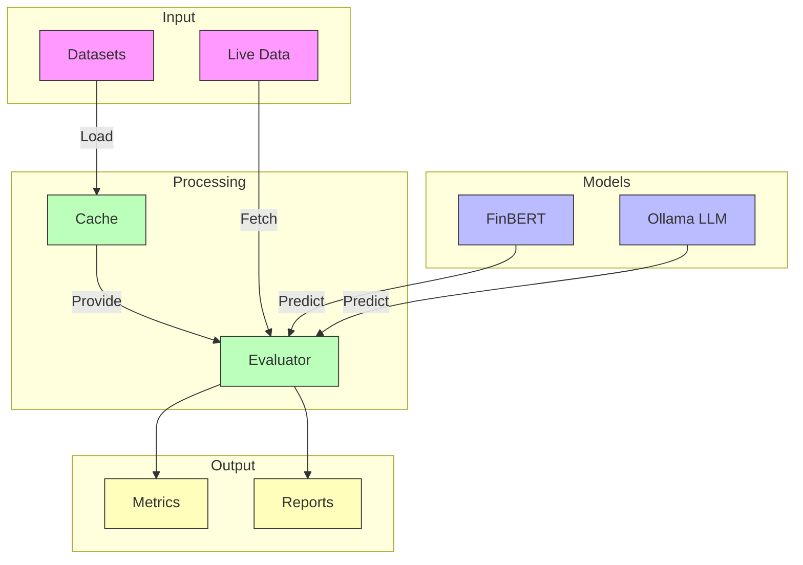

# Financial News Sentiment Analysis

A production-ready system for analyzing sentiment in financial news using state-of-the-art language models. This project was generated by an AI Agent using the provided `prompt.md` and prototype notebook in the `/prototype` folder.

## Overview

This system compares the performance of a specialized financial sentiment analysis model (FinBERT) with a general-purpose LLM (Qwen3 via Ollama) on financial news classification. It supports both batch evaluation using labeled datasets and real-time analysis of live financial news.

### Architecture



## Features

- **Multiple Models**: Support for both transformer-based models (FinBERT) and large language models (via Ollama)
- **Extensible Architecture**: Easy to add new models, datasets, and evaluation metrics
- **Live Data Integration**: Real-time sentiment analysis of financial news from Yahoo Finance
- **Robust Evaluation**: Comprehensive evaluation metrics using scikit-learn
- **Async Support**: Asynchronous processing for live data fetching and batch predictions
- **Production-Ready**: Includes logging, monitoring, caching, and error handling
- **Well-Documented**: Comprehensive documentation and type hints throughout

## Installation

1. Clone the repository:
   ```bash
   git clone https://github.com/adam-j-baron/financial-news-sentiment.git
   cd financial-news-sentiment
   ```

2. Install Poetry (if not already installed):
   ```bash
   curl -sSL https://install.python-poetry.org | python3 -
   ```

3. Install dependencies:
   ```bash
   poetry install
   ```

4. Install and start Ollama (required for LLM support):
   ```bash
   # Follow instructions at https://ollama.ai
   ollama pull qwen3
   ```

## Quick Start

1. Run model evaluation:
   ```bash
   poetry run fins evaluate --max-samples 100
   ```

2. Analyze live news for a stock:
   ```bash
   poetry run fins analyze-news YELP --max-articles 5
   ```

## Configuration

The system is configured via a YAML file. You can specify:
- Model parameters (FinBERT and Ollama settings)
- Dataset configurations
- Evaluation metrics
- Live data sources
- Caching settings
- Logging preferences

Example configuration:
```yaml
app:
  name: "financial-news-sentiment"
  environment: "development"
  log_level: "INFO"

models:
  finbert:
    device: "auto"
    batch_size: 32
  
  ollama:
    url: "http://localhost:11434"
    model: "qwen3"
    timeout: 30

live_data:
  yfinance:
    timeout: 30
    max_retries: 3
```

## Extending the System

### Adding a New Dataset

1. Create a new class inheriting from `BaseDatasetLoader`:
```python
from financial_news_sentiment.datasets import BaseDatasetLoader

class CustomDatasetLoader(BaseDatasetLoader):
    def __init__(self, name: str):
        super().__init__(name)
    
    def load(self, max_samples: Optional[int] = None):
        # Implement dataset loading logic
        return texts, labels
```

2. Update configuration to include the new dataset.

### Adding a New Model

1. Create a new class inheriting from `BaseSentimentModel`:
```python
from financial_news_sentiment.models import BaseSentimentModel

class CustomModel(BaseSentimentModel):
    def __init__(self, name: str):
        super().__init__(name)
    
    def predict(self, text: str):
        # Implement prediction logic
        return sentiment_label
```

2. Add model configuration in `config.yaml`.

### Adding New Metrics

1. Create a new class inheriting from `BaseEvaluator`:
```python
from financial_news_sentiment.evaluation import BaseEvaluator

class CustomEvaluator(BaseEvaluator):
    def __init__(self, name: str):
        super().__init__(name)
    
    def evaluate(self, true_labels, predicted_labels):
        # Implement evaluation logic
        return metrics
```

## Development

### Setup

1. Install development dependencies:
   ```bash
   poetry install --with dev
   ```

2. Install pre-commit hooks:
   ```bash
   poetry run pre-commit install
   ```

### Testing

Run tests with pytest:
```bash
poetry run pytest
```

With coverage:
```bash
poetry run pytest --cov=financial_news_sentiment
```

### Code Quality

Format code:
```bash
poetry run black src tests
poetry run isort src tests
```

Type checking:
```bash
poetry run mypy src
```

Security checks:
```bash
poetry run bandit -r src
```

### Documentation

Generate API documentation:
```bash
poetry run make docs
```

View documentation at `docs/_build/html/index.html`.

## License

This project is licensed under the MIT License - see the LICENSE file for details.

## Contributing

See CONTRIBUTING.md for contribution guidelines.

## Acknowledgments

- Original prototype code is available in the `/prototype` folder
- This project was generated by an AI Agent using the provided prompt
- Thanks to ProsusAI for the FinBERT model
